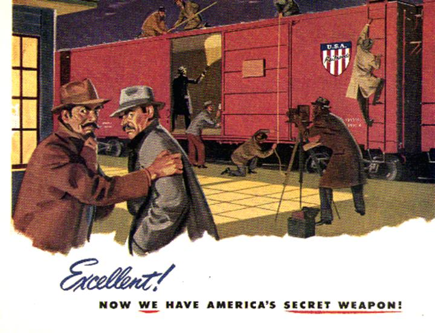

<!-- PROJECT LOGO -->
 

  

 
 

<!-- BACKGROUND & TITLE -->

  
  <h3 align="center">Honors Inquiry — Twentieth Century Espionage</h3>
 

<!-- TABLE OF CONTENTS -->
## Table of Contents

* [**Notes**](https://github.com/MDBrodskiy/Honors_Inquiry/tree/master/Notes)
  * [**Includes**](https://github.com/MDBrodskiy/Honors_Inquiry/tree/master/Notes/Includes.tex)
  * [**The Great Game**](https://github.com/MDBrodskiy/Honors_Inquiry/tree/master/Notes/Notes1.pdf)
  * [**The Information Revolution**](https://github.com/MDBrodskiy/Honors_Inquiry/tree/master/Notes/Notes2.pdf)
<!--
  * [**Chapter 1**](#Notes/Chapter\ 1)
* [**Exams**](#Exams)
* [**Projects**](#Projects)
-->

An assortment of lecture notes and exams from Northeastern University's HONR1310 (Fall 2022)
    
Open sourced **LaTeX** Templates [here](https://www.latextemplates.com/).
 
**TikZ** diagram editor [here](https://www.mathcha.io/editor).
 
**TikZ** examples [here](https://www.texample.net/tikz/example).
 
**LaTeX** draw [here](https://www.latexdraw.com/).
     
Authentication:   
    <pre>to receive commit access to this repository e-mail Michael@Brodskiy.com for credential verification/authorization</pre>

Cloning This Repository
 &nbsp;&nbsp;with **command line interface**:
    <pre>    
    **$** git clone https://github.com/MDBrodskiy/Honors_Inquiry.git    
    **$** **>**  **_**
    </pre>
